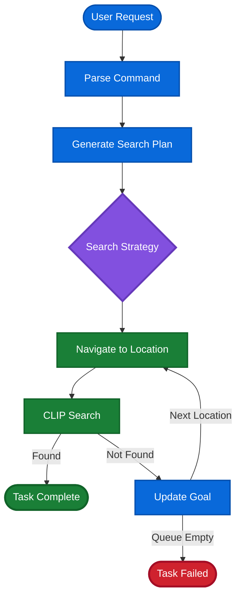

> [!NOTE]
> This project has been superseded by [APTLS-ROS2](https://github.com/rasika-lokhande/aptls-ros2).
> This repo is kept for reference only.


# FetchBot: Autonomous Semantic Search & Retrieval

FetchBot is a ROS2-based robotics project that enables a robot to locate objects in a household environment using natural language commands. Unlike traditional search robots that rely on random exploration, FetchBot uses **Behavior Trees**, **Large Language Models (GPT-4o-mini)**, and **Vision-Language Models (CLIP)** to perform "semantic search"—finding objects based on where they are statistically most likely to be located.

## 🌟 Overview

FetchBot brings a "common sense" approach to robotics. If you tell the robot "I'm thirsty," it:

1. **Reasons** that "thirsty" implies a need for a "green bottle" using an LLM.
2. **Plans** a path prioritized by probability (e.g., checking the kitchen at 60% probability before the office at 5%).
3. **Recognizes** the object in real-time using a Dockerized CLIP inference server.
4. **Recovers** autonomously if the object is not found at the primary location by updating its goal to the next most likely room.

---

## 🏗 System Architecture


### 🧠 Decision Making (Behavior Trees)

The project uses `py_trees` to manage the robot's lifecycle. The tree structure allows for modularity and reactive decision-making:

* **Command Parsing:** Converts "I'm thirsty" into a specific target object.
* **Search Planning:** Generates a queue of locations sorted by environmental probability.
* **Search Strategy Selector:** A `memory=False` selector that coordinates between navigation/searching and updating the goal when a search fails.

### 👁 Vision Pipeline

To maintain high performance and isolate heavy dependencies (PyTorch/Transformers), the vision system is decoupled:

* **Inference Server:** A Docker container running OpenAI's CLIP, exposed via a Flask API.
* **Vision Bridge:** A ROS2 node that converts `sensor_msgs/Image` to Base64, calls the API, and publishes custom `Detection` messages.

### 🎮 Episode Management

For robust simulation and testing, the **Episode Manager** automatically:

* Randomly spawns target objects in rooms based on a weighted probability distribution.
* Manipulates Gazebo model states via `gz service` calls.
* Resets the robot's initial pose using the `Nav2` Simple Commander API.

---

## 📊 Logic Flow



---

## 🧩 Component Breakdown

### 1. Behavior Tree Behaviours (`fetchbot_behaviours`)

* **`ParseCommand`**: Service client for the LLM node; stores the `target_object` on the Blackboard.
* **`GenerateSearchPlan`**: Uses `LocationInfo` to create a prioritized navigation queue.
* **`NavLocation`**: Action Client interfacing with the **Nav2 Stack**.
* **`Search`**: Action Client that triggers a 360-degree rotation while active-scanning with CLIP.
* **`UpdateGoal`**: Logic that pops the next best location from the queue if the previous search fails.

### 2. Semantic Parser (`fetchbot_language`)

* **Engine**: GPT-4o-mini via OpenAI's Structured Outputs (Pydantic).
* **Function**: Maps vague human requests to specific object IDs within the robot's known list.

### 3. Perception & Vision (`fetchbot_perception`)

* **`VisionBridgeNode`**: Subscribes to `/camera/image_raw`, handles JPEG encoding, and manages API requests to the CLIP Docker container.
* **`ObjectSearchNode`**: An Action Server that controls the robot's rotation (`cmd_vel`) until the target's confidence exceeds the threshold.

---

## 🛠 Tech Stack

| Component | Technology |
| --- | --- |
| **Robotics Middleware** | ROS2 (Jazzy) |
| **Simulation** | Gazebo / TurtleBot3 House |
| **Navigation** | Nav2 |
| **Logic/Autonomy** | `py_trees` (Behavior Trees) |
| **Natural Language (LLM)** | OpenAI GPT-4o-mini |
| **Vision (VLM)** | OpenAI CLIP (Dockerized) |

---

## 🚀 Getting Started

### 1. Prerequisites

* ROS2 Jazzy
* Docker
* OpenAI API Key (Exported as `OPENAI_API_KEY`)
* Gazebo Sim (v8.10.0)

### 2. Vision Setup (Docker)

Build and run the CLIP inference server:

```bash
docker build -f .docker/Dockerfile -t fetchbot-vision .
docker run --rm -p 5000:5000 fetchbot-vision

```

### 3. Launching the System

```bash
cd fetchbot
ros2 launch fetchbot_bringup findbot_launch.py

```


---

## 📝 Custom Interfaces

* `ParseFetchCmd.srv`: LLM communication for intent extraction.
* `Detection.msg`: CLIP results (label + confidence score).
* `SearchObject.action`: 360-degree rotation search logic.

---

### Next Steps

* [ ] **Grasp:** Integrate MoveIt2 for robotic arm manipulation.

## 🚧 Known Limitations

- Currently limited to pre-mapped environments and objects.
- CLIP confidence threshold may need tuning for cluttered scenes

