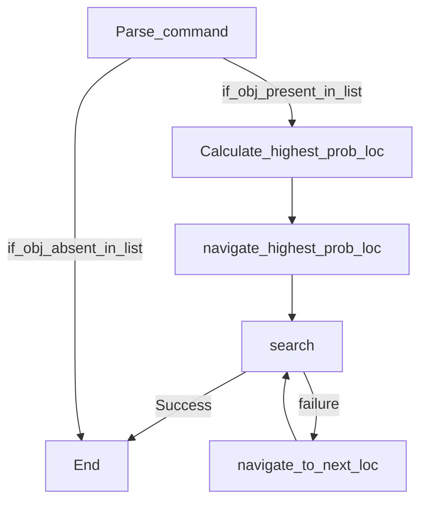

```mermaid
    flowchart TD
    Parse_command --if_obj_present_in_list--> Calculate_highest_prob_loc
    --> navigate_highest_prob_loc --> search 
    --Success--> End
    search --failure--> navigate_to_next_loc --> search 
    navigate_to_next_loc 


    Parse_command --if_obj_absent_in_list--> End

```

1. Spawn objects randomly according to probablity in different rooms 
